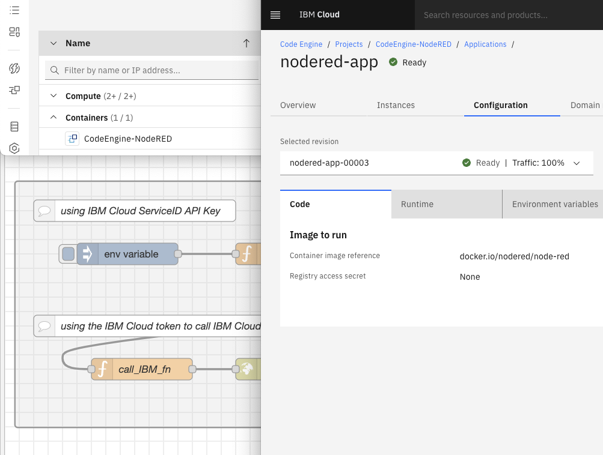

## From Arduino Cloud to IBM Cloud () - containerized Node-RED on IBM Cloud

This repository documents my minute but coherent project, done while exploring [IBM Cloud offerings](https://www.ibm.com/cloud/products/) …
and contains descriptions as well as code samples (flows and functions written).

The idea behind this, is that I would like to get gps coordinates from my arduino boards (that I am sending to Arduino Cloud), to the IBM Cloud. Preferably with as little coding as possible (low-code programming), ready for Exploratory Data Analysis.

Documentation is divided into 2 parts:

 - (1) [from Arduino to … Cloudant (JSON document DBaaS)](./2ibm_cloudant)
 - (2) [adding COS (Cloud Object Storage) with Functions and Data Engine](./2ibm_cos)

It is not a comprehensive guide; it assumes that the IBM Cloud account and a local IBM Cloud CLI, as well as the boards sending data to Arduino Cloud are already provisioned.

Starting point links:

 - Arduino Cloud DOCS : [docs.arduino.cc/arduino-cloud/](https://docs.arduino.cc/arduino-cloud/)
 - IBM Cloud DOCS : [cloud.ibm.com/docs/](https://cloud.ibm.com/docs/)
 - IBM Cloud CLI : [cloud.ibm.com/docs/cli/](https://cloud.ibm.com/docs/cli/)
 - IBM Cloud Catalog : [cloud.ibm.com/catalog?search=label%3Aibm_created](https://cloud.ibm.com/catalog?search=label%3Aibm_created)
